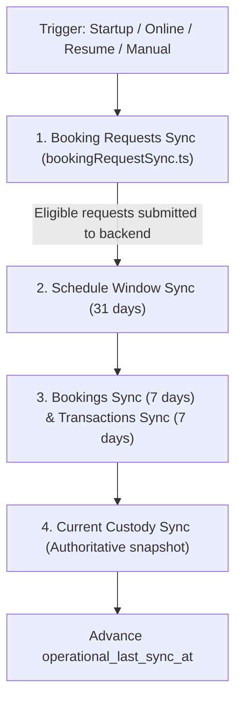

# Sloty Offline & PWA Architecture

This document is the canonical architectural specification for the Progressive Web App (PWA), local storage, freshness policies, and operational synchronization engine in Sloty frontend.

---

## 1. Core Architectural Philosophy

1. **Local Resilience Without Local Authority:**
   The backend is the sole source of truth for business rules, slot availability, pricing, permissions, and money. The frontend never calculates slot availability, pricing periods, financial net, or settlement facts locally.
2. **Authoritative Snapshots, Not Parallel Domain Models:**
   Offline data consists of read-only snapshots of backend responses (`BookingSlot[]`, `Booking[]`, `Transaction[]`, and custody snapshots). Sloty does not maintain parallel client-side relational tables or local business engines.
3. **Single Offline Operational Write:**
   The **only** business action permitted offline is saving a **Booking Request** (`BookingRequestRecord`) from a cached FREE slot. All other business mutations (payments, refunds, cancellations, completions, no-shows, reschedules, recurrence stops, and settlements) **require an active internet connection** and must never be queued.
4. **Strict Scope Isolation:**
   Operational data stored in IndexedDB is strictly isolated by user identity and club slug. Multi-user shared devices must never leak customer or financial data across accounts or clubs.

---

## 2. Progressive Web App (PWA) Foundation

PWA infrastructure lives under `src/pwa` and integrates with `AppShell`, `AuthProvider`, and React Router.

### Service Worker & Precaching
- Configured via `vite-plugin-pwa` with `generateSW` and prompt-based registration.
- **Precached Assets:** Compiles and precaches static application shell assets only: JavaScript bundles, CSS stylesheets, HTML shell, web app manifest (`manifest.webmanifest`), favicon, and approved static brand imagery.
- **NO Runtime Caching:** The Service Worker **must not** implement `runtimeCaching` for `/api/v1/`, auth endpoints, `/me`, bookings, slots, transactions, settlements, or users. Read resilience is owned by IndexedDB (`src/offline`), not browser HTTP cache or Service Worker intercepts.

### Web App Manifest & Routing
- `start_url` is set to `/` (not `/schedule`). This ensures `AuthLandingRedirect` correctly evaluates authentication state, Platform Admin role, club memberships, and operational routing upon launch.

### Browser Storage Durability
- At application startup, the PWA invokes `navigator.storage.persisted()` and `navigator.storage.persist()` once as a best-effort durability improvement.
- Unsupported browser APIs or denied persistence requests must fail silently and never block login, offline mode, or normal application use.

### Install Experience
- **Chromium:** Captures the `beforeinstallprompt` event and surfaces an install action. Once installed, standalone mode hides the promotion.
- **iOS Safari:** Renders clear, concise manual "Add to Home Screen" instructions.
- **Install Copy:** Frames the benefit around faster Home Screen access and saved customer requests needing confirmation. It never promises offline booking creation, automatic confirmation, or offline payments.

### Application Updates
- PWA updates are prompt-based (`تحديث الآن` / `لاحقًا`) and **never** auto-reload the application upon worker discovery.
- `AppShell` suppresses update prompts whenever a modal task, sheet (`AppSheet`), or drawer is active, or when a full-page editor may contain unsaved work. Prompts reappear once the transient task is dismissed or route changes.

---

## 3. Storage Architecture (Dexie)

Structured local data lives in `src/offline` within the versioned Dexie database `sloty_local_db`.

### Schema & Versions
The current database schema is version 3. Any schema or index change must increment the version number and provide an explicit Dexie migration.

```typescript
// Physical stores in sloty_local_db (Version 3)
sync_metadata: 'scope_key'
schedule_days: '[scope_key+court_id+date], scope_key, court_id, date, synced_at'
bookings: '[scope_key+booking_id], scope_key, court_id, start_time, synced_at'
booking_details: '[scope_key+booking_id], scope_key, cached_at'
transactions: '[scope_key+transaction_id], scope_key, court_id, created_at, synced_at'
transaction_details: '[scope_key+transaction_id], scope_key, cached_at'
current_custody_snapshots: '[scope_key+kind+collector_scope+court_scope], scope_key, kind, cached_at'
booking_intents: 'local_id, scope_key, [scope_key+court_id], status, client_request_id, created_at'
offline_context: 'schema_version'
```

### Table Definitions & Responsibilities

1. `sync_metadata`:
   Tracks device-local synchronization timestamps for each `scope_key`:
   - `operational_last_sync_at`: Advances only when a full operational sync cycle succeeds.
   - `schedule_last_sync_at`: Updated upon atomic schedule window replacement.
   - `bookings_last_sync_at`: Updated upon atomic 7-day bookings replacement.
   - `transactions_last_sync_at`: Updated upon atomic 7-day transactions replacement.
   - `current_custody_last_sync_at`: Updated upon custody snapshot replacement.
2. `schedule_days`:
   Stores backend-generated `BookingSlot[]` snapshots per Court and date. A record with zero slots represents an authoritative synchronized empty day, distinguishing it from missing cache.
3. `bookings`:
   Authoritative snapshot of the previous 7 Egypt-local calendar days of bookings.
4. `booking_details`:
   Lazy cache of full `Booking` details fetched during online operations. Canonical list sync does not N+1 prefetch details.
5. `transactions`:
   Authoritative snapshot of the previous 7 Egypt-local calendar days of transactions.
6. `transaction_details`:
   Lazy cache of full `Transaction` details fetched during online operations.
7. `current_custody_snapshots`:
   Authoritative snapshot of backend settlement preview (Staff) or grouped unsettled summary (Owner/Manager).
8. `booking_intents`:
   Physical store for `BookingRequestRecord` entities (canonical type is `BookingRequestRecord`; `BookingIntentRecord` is a transitional alias).
9. `offline_context`:
   Stores the last Backend-verified `/me` context (user ID, selected club slug, role, assigned court). Contains **no tokens, passwords, PINs, or calculated permissions**.

### Storage Error Handling
- All IndexedDB operations handle failures non-fatally.
- Storage errors are logged with generic error codes; they **never** log customer names, phone numbers, money amounts, or auth credentials.
- Runtime storage errors must never trigger destructive database deletion or recreation.

---

## 4. Scope Isolation & Multi-User Safety

Every operational record stored in Dexie must carry a deterministic scope key generated by:

```typescript
createOfflineScopeKey(userId: number | string, clubSlug: string): string
```

### Multi-User / Multi-Club Rules
- No operational read or write may execute without a verified `scope_key`.
- Platform Admins do not share an all-clubs namespace. When acting in a club, their data is scoped to `user:{platformAdminId}:club:{clubSlug}`.
- Staff is strictly scoped to `selectedMembership.court`. Staff never receives a query shortcut or repository method to read all courts in a club.
- **Explicit Logout:**
  1. Awaits any pending context writes.
  2. Clears every sensitive operational record matching `user:{currentUserId}:*`.
  3. Clears auth session, tokens, and selected club state.
- **Session Expiry:** Does **not** wipe the local cache, allowing offline viewing if the user remains offline. Scope isolation guarantees another user logging in cannot read the prior user's data.

---

## 5. Offline Freshness Policy

Freshness policy is centralized under `src/offline/freshness`. Raw timestamp comparisons must not be scattered throughout UI components.

Freshness is evaluated per `scope_key` using `sync_metadata.operational_last_sync_at`:

| Duration Since Last Sync | Classification | System Behavior |
| :--- | :--- | :--- |
| **< 12 hours** | `FRESH` | Normal offline operation. Cached reads render without warnings. New Booking Requests may be created. |
| **12 to 72 hours** | `STALE` | Operational warning banner appears in offline UI: `بيانات غير محدثة`. Cached reads and Booking Request creation remain available. |
| **> 72 hours** | `EXPIRED` | Cache is preserved for viewing. Creation of **new** local Booking Requests is disabled with message requiring internet sync. Existing pending requests are retained. |

> [!IMPORTANT]
> The 72-hour rule applies **only** to offline creation of new Booking Requests. It **never** blocks online booking creation and **never** deletes or expires local requests whose appointment time has passed.

---

## 6. Centralized Synchronization Engine

Operational synchronization is owned by `OfflineSyncCoordinator` (in `src/offline/sync`) and mounted once via `OfflineSyncProvider` in `AppShell`.

### Non-Negotiable Sync Rules
- Individual pages (`SchedulePage`, `BookingsPage`, `TransactionsPage`) **must not** register their own `online`, `offline`, or `visibilitychange` sync listeners.
- `navigator.onLine` is treated as a browser hint only. True reachability is established only when backend HTTP requests succeed.

### Fixed Dataset Priority
Synchronization runs tasks in a strict business sequence:



1. **Booking Requests First:** Eligible requests (`PENDING_SYNC` and stale `SYNCING`) are submitted to the backend first because they create new backend truth.
2. **Schedule Second:** Atomically refreshes the 31-day slots window.
3. **Bookings & Transactions Third:** Refresh secondary historical ledgers (previous 7 days) in parallel.
4. **Current Custody Fourth:** Pulls authoritative unsettled financial custody from the backend.
5. **Freshness Commit:** `operational_last_sync_at` advances only after all datasets settle successfully.

### Coalescing & Lifecycle Safety
- **Single-Flight:** Sync tasks are single-flight by `scope_key` and `scope_key + dataset`. Concurrent triggers coalesce into the running operation.
- **Scope Cancellation:** When the user switches clubs or logs out, in-flight sync work for the previous scope is aborted. Late responses for a previous scope are discarded and never written to the new scope's cache.
- **Conservative Retry:** If sync fails, one delayed retry is scheduled. The system then remains dormant until the next lifecycle trigger (visibility resume, online event, or manual trigger). Aggressive polling loops are forbidden.

---

## 7. Bounded Cache Windows

To prevent unbounded storage growth and stale data accumulation, local caching is strictly bounded:

### 1. Schedule Window (Today + 30 Days)
- Fetches `clubs/{club_slug}/bookings/slots/` with `date_from={today}` and `date_to={today + 30 days}`.
- Partitions slots by `slot.date` and atomically replaces `schedule_days` for that Court.
- Staff syncs only their assigned Court. Owner/Manager sync the currently viewed Court first, followed by remaining active Courts.

### 2. Bookings Window (Previous 7 Days)
- Fetches the previous 7 Egypt-local calendar days (including today) using `date_from` and `date_to`.
- Paginates through all pages before committing an atomic replacement to `bookings`.
- Online `/bookings` remains server-backed. Offline `/bookings` queries IndexedDB and supports local search (customer name/phone) and safe cached-field filters.

### 3. Transactions Window (Previous 7 Days)
- Fetches the previous 7 Egypt-local calendar days (including today).
- Paginates through all pages before committing an atomic replacement to `transactions`.
- Online `/transactions` remains server-backed. Offline `/transactions` queries IndexedDB and supports local search (reference, customer name/phone) and local sorting.

### 4. Current Custody Snapshot
- Staff stores backend settlement preview (`GET clubs/{club_slug}/settlements/preview/`).
- Owner/authorized Manager stores grouped summary (`GET clubs/{club_slug}/settlements/unsettled-summary/`).
- Keyed by `scope_key + kind + collector_scope + court_scope`.
- Offline custody displays backend `net_amount`, `transaction_count`, and method breakdowns directly. It **never** reduces Transaction rows or uses `Math.abs`.
- Missing cache renders an error/internet-required state, **never a fake zero**.

---

## 8. Offline Operational Mutation Boundaries

Sloty strictly enforces that offline operations are read-only with exactly one exception:

```text
ALLOWED OFFLINE:
✓ Saving a Booking Request from an available cached FREE slot (PENDING_SYNC)

FORBIDDEN OFFLINE (Requires active internet connection):
✗ Final Booking creation (online API call)
✗ Recording a payment (RecordPaymentSheet)
✗ Cancelling a transaction
✗ Creating or confirming a settlement
✗ Cancelling a booking
✗ Completing a booking
✗ Marking a booking as no-show
✗ Rescheduling a booking
✗ Stopping active recurrence
✗ Editing customer details on existing Bookings
```

Any attempt to execute a forbidden mutation while offline must display an internet-required notice and refuse to queue the action.

