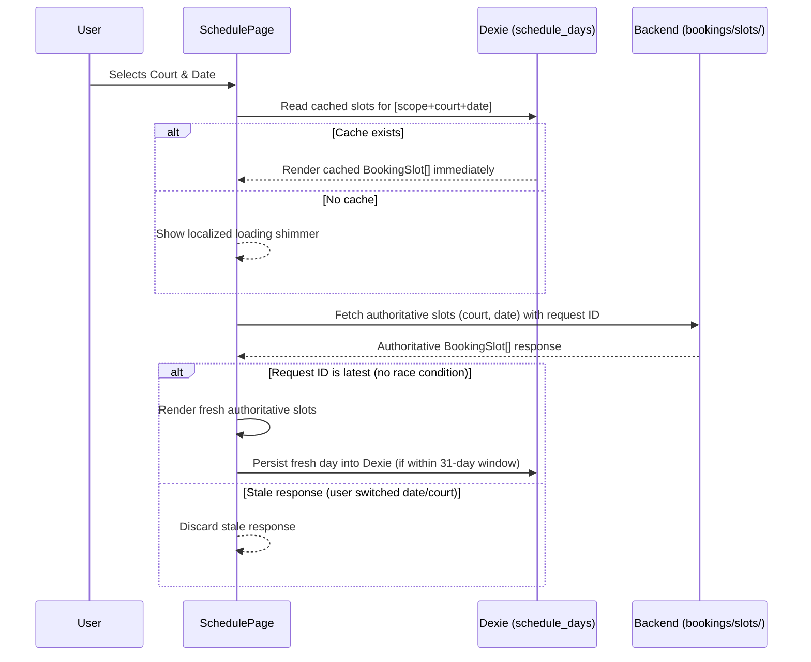

# Sloty Operational Schedule Architecture

This document is the canonical architectural specification for the authenticated operational Schedule workspace (`/schedule`) in Sloty frontend.

---

## 1. Product Role & Workspace Overview

- **Primary Operational Home:** `/schedule` is the authenticated Home workspace labeled `الرئيسية`. After login, navigation home, or tapping the mobile floating action button (`NewBookingFAB`), users land on `/schedule`.
- **Purpose:** Fast daily court availability visualization, booking creation, appointment lifecycle management, payment recording, and daily shift closing for club staff, managers, and owners.
- **Header & Visual Hierarchy:**
  - Authenticated `AppShell` provides a single canonical `PageHeader`.
  - Schedule presents a clear, uncluttered hierarchy: authorized Court selection (when multi-court), `اختار اليوم` (`AppDateNavigator`), operational closing section (`حجوزات تحتاج إغلاق` for today only), followed by `اختار المعاد` (the AM/PM slot grid).
  - A lightweight informational status legend sits near the slot grid without competing with date and slot headings.

---

## 2. FE-038 Dual-Fetch Lifecycle (Cache-First != Cache-Only)

Schedule implements the **FE-038 dual-fetch contract** to combine instant local rendering with authoritative server accuracy:



### Key Lifecycle Principles:
1. **Cache-First for Instant UX:**
   For dates within the 31-day window (today + 30 days), Schedule reads IndexedDB first and renders cached slots immediately.
2. **Foreground Network Fetch ALWAYS Executes:**
   Cache-first does **not** mean cache-only. A foreground request to `clubs/{club_slug}/bookings/slots/?court={courtId}&date={YYYY-MM-DD}` **always** fires to pull authoritative backend truth.
3. **Stale Response Protection:**
   Fast date or court switching tracks request IDs and abort signals. Out-of-order network responses are discarded so older requests cannot overwrite newer user selections.
4. **Independent Background Window Sync:**
   The centralized `OfflineSyncCoordinator` synchronizes the complete 31-day schedule window in the background without blocking or conflicting with foreground day requests.

---

## 3. Scoping by Role & Court

Court access is strictly enforced based on verified `/me` membership context:

- **Staff Memberships:**
  - Tied strictly to `selectedMembership.court`.
  - Staff **never** sees a Court selector on Schedule.
  - Foreground requests and background sync are locked to the assigned Court.
- **Owner & Manager Memberships:**
  - May access all active courts belonging to the selected club.
  - An accessible Court selector is displayed above the date navigator.
  - Background schedule sync prioritizes the currently viewed Court first, followed by other active courts.

---

## 4. Date Navigation (`AppDateNavigator`)

Schedule uses `AppDateNavigator` as its single date selection primitive:

- **Single Source of Truth:** A single `YYYY-MM-DD` date string controls schedule state.
- **Rolling Strip & Calendar Picker:**
  - Combines a horizontal rolling 7-day date strip with a full-month calendar modal (`@daypicker/react`).
  - Selecting a visible day in the strip updates only the selected date.
  - Selecting a date outside the current strip from the calendar modal rebuilds the 7-day strip centered around the new date.
- **Brand Presentation:**
  - Selected days use Sloty's rounded green surface (`bg-emerald-600 text-white`).
  - Today is subtly marked with an amber border/pill (`border-amber-400 text-amber-900 bg-amber-100`) when not selected, without overriding the primary green selection.
- **Responsive Sheet / Modal:**
  - Mobile view renders the calendar picker inside an `AppSheet` (bottom sheet).
  - Desktop view renders the calendar picker as a compact modal dialog.

---

## 5. Slot Grid & Visual Presentation

### AM / PM Split
To prevent overwhelming vertical scrolling and improve mental mapping, daily slots are grouped into two contextual containers split at 12:00 noon:
- **`مواعيد الصباح` (AM - before 12:00):** Warm, light cream/daylight background surface.
- **`مواعيد المساء` (PM - 12:00 onward):** Deeper, calm night surface.

### Canonical Slot States & Display
Slots are rendered using compact, accessible button cards showing **start time**, **localized status**, and an optional **`↻` recurrence icon**. Slot buttons **never** display customer names, phone numbers, notes, or money amounts.

| Backend State | Product Label | Visual Styling | Click Action |
| :--- | :--- | :--- | :--- |
| `FREE` | `متاح` | Subtle white/neutral card, green hover | Opens `AddBookingSheet` (or offline Booking Request sheet) |
| `HOLD` | `بانتظار العربون` | Amber badge, distinct hold styling | Opens HOLD action sheet (payment or cancel) |
| `CONFIRMED` | `العربون مدفوع` | Calm blue/slate surface | Opens canonical `BookingActionSheet` |
| `COMPLETED` | `تم اللعب` | Muted green/gray, locked | Opens canonical `BookingActionSheet` (read-only) |
| `NO_SHOW` | `عدم حضور` | Muted red/brown, locked | Opens canonical `BookingActionSheet` (read-only) |
| `RECURRING_RESERVED` | `محجوز` (`↻`) | Calm recurring border/badge | Opens `VirtualRecurringSlotDetailsSheet` |
| `UNAVAILABLE` | `غير متاح` | Muted disabled card | Disabled / Non-clickable |

### Virtual Recurring Slots (`RECURRING_RESERVED`)
- Represents an unmaterialized future weekly occurrence.
- Clicking opens `VirtualRecurringSlotDetailsSheet` populated from `slot.recurring_context`.
- **Invariants:** Never fetch the anchor booking as the occurrence, never reuse anchor payment/financial state, and treat `recurring_anchor_booking_id` solely as context for `إيقاف الحجز الأسبوعي`.

---

## 6. Operations & Workflows

### 1. Booking Creation (`AddBookingSheet`)
- Opened by clicking a `FREE` slot.
- Collects customer name, mobile phone (`SlotyPhoneNumberInput`), and optional notes.
- Weekly recurrence is controlled by the `ثبّت نفس الموعد كل أسبوع` checkbox. Recurrence eligibility is tri-state:
  - `can_start_recurring === true`: Checkbox enabled.
  - `can_start_recurring === false`: Checkbox disabled with backend conflict explanation (`first_recurring_conflict_start`).
  - `can_start_recurring === null`: Checkbox disabled with message requiring fresh backend check.
- Submits `is_recurring: true` when checked. Never sends `source: 'RECURRING'`.

### 2. Occupied Slot Review (`BookingActionSheet`)
- Canonical action sheet for all concrete bookings (HOLD, CONFIRMED, COMPLETED, NO_SHOW).
- Primary actions based on state:
  - `HOLD`: `سجّل العربون وأكّد الحجز` (opens `RecordPaymentSheet`).
  - `CONFIRMED` with remaining balance: `حصّل X ج.م` (opens `RecordPaymentSheet`).
  - `CONFIRMED` fully paid & appointment ended: Visually exposes `إكمال` and `عدم حضور`.
- Secondary actions under `••• خيارات أخرى`:
  - `تعديل بيانات الحجز`: PATCHes customer name, phone, notes only.
  - `تغيير الموعد`: Posts to reschedule endpoint for non-active-recurring bookings.
  - `إلغاء الحجز`: Confirms cancellation with preview and reason sheet.
  - `إيقاف الحجز الأسبوعي`: Available inline for active recurring bookings.

### 3. Post-Mutation Refresh Rule
- Every mutation (booking creation, payment, cancel, complete, no-show, reschedule, recurrence stop) **must refetch authoritative slots from the backend** for the active Court and date.
- The fresh day response is persisted to Dexie if the date falls within the 31-day window.
- The frontend **never** fakes status transitions (e.g. locally mutating HOLD to CONFIRMED or moving slots locally).

---

## 7. Daily Closing Section (`حجوزات تحتاج إغلاق`)

- Appears at the top of the Schedule workspace for **today only**.
- Shows at most 3 bookings needing urgent status or payment closure (HOLD awaiting deposit, or ended appointments awaiting remaining payment/completion).
- Excludes CANCELLED, EXPIRED, NO_SHOW, and COMPLETED bookings.
- If more than 3 bookings require action, displays a link to `/bookings?needs_action=true`.
- Clicking any row opens the canonical `BookingActionSheet`.

---

## 8. Share Public Schedule Action

To allow club staff and owners to easily share a court's availability with players:
- A prominent **`مشاركة الجدول`** (Share) button is placed in the **`PageHeader` top-left action slot** of `/schedule` via `PageHeaderAction`.
- **Target Destination:** Shares or copies the canonical **Public Schedule URL** for the currently viewed Court:
  ```text
  /public/:clubSlug/courts/:courtId/schedule
  ```
- **Implementation & Invariants:**
  - Never shares the authenticated `/schedule` URL.
  - Uses the currently viewed Court already selected by `SchedulePage`.
  - Implements native sharing via `navigator.share` on mobile/supported platforms, falling back to clipboard copy (`navigator.clipboard.writeText`) on desktop/unsupported environments.
  - Clipboard fallback provides instant button feedback (`✓ تم النسخ`) and displays the canonical confirmation notice:
    ```text
    تم نسخ رابط الجدول
    الرابط جاهز للمشاركة مع اللاعبين.
    ```

